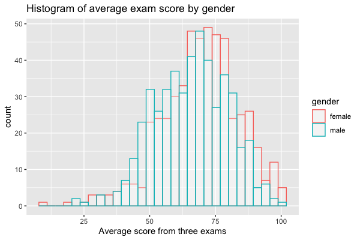
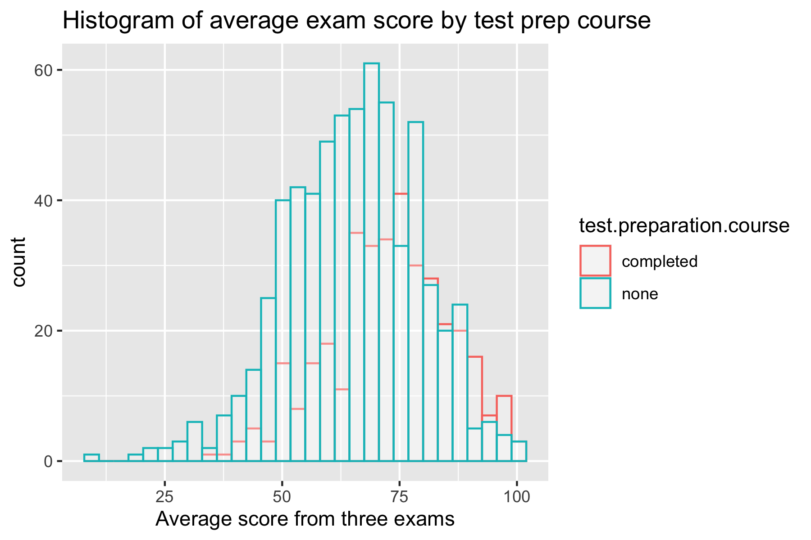
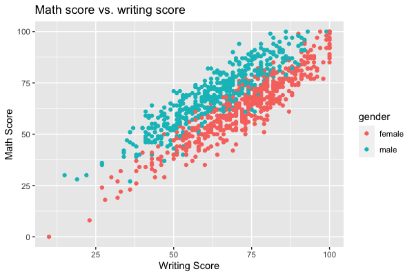

Project 1 BIOS 611
==================
Test Score Dataset
------------------

Proposal
--------

### Introduction

Through the formative years of every young student's life, they are often inundated by the task of taking exams to assess knowledge in a variety of subject matter areas. Although few students find taking exams to be an enjoyable tasks, the results are often indicative of one's aptitude for learning. On the outside of every exam experience, a multitude of outside factors can influence student performance aside from the raw education received in the classroom.

Does gender play a significant role in exam performance among different subject areas? Can we predict if a student will perform better on an exam due to their cultural background, the education level of their parents, or whether or not they took a test prep course prior to taking exams?

In this project, we'll investigate the connections between these factors and the resulting test scores from a publicly available dataset. This analysis will be completed with linear regression modeling and other machine learning techniques that will help to predict a student's test outcome based on their personal background.

### Dataset

The dataset we will analyze is publicly available on Kaggle and it covers student test score performance metrics for mathematics, reading, and writing tests. The dataset can be downloaded from .

Note that the aforementioned dataset will be available on the github repository and will not need to be obtained from Kaggle for observation/further analysis.

### Preliminary Figures & Exploratory Data Analysis

All figures can be found in the "figures" folder as well.

The figure above shows that female students tend to score higher on a combined average of the math, reading, and writing exams when compared to male students.

The figure above shows that students who did not take a test preparation course scored better than students who did. There are likely some interesting confounding variables that can be explored to find out the true cause. A sort of "survival bias" may also be in play where students who will already do well on tests do not need to take test preparation courses.

The figure above shows that among students with similar reading scores, male students tend to have better math scores than female students. On the other hand, among students with similar math scores, female students tend to have better reading scores than male students.

Usage.
------

You'll need Docker and the ability to run Docker as your current user.

You'll need to build the container:

    > docker build . -t project1-env

This Docker container is based on rocker/verse. To run rstudio server:

    > docker run -v "`pwd`:/home/rstudio" -p 8787:8787\
    -e PASSWORD=mypassword -t project1-env

Then, connect to the machine on port 8787.

After that, you can view/edit the project in RStudio!

Makefile
--------

The Makefile is an excellent place to look to get a feel for the project.

To build figures relating to the student test scores for example, enter Bash either via the above incantation or
with Rstudio and say:

	>make figures/hist_avgscore_gender.png
 
 You can also build the final report by simply entering the following command into the terminal:
 
  >make final_report_update.pdf
  
  If you encounter errors when building the report, a finalized pdf version of the project report can also be found in the github repository titled "final_report_update.pdf".

Shiny App
---------

To get a better feel for some of the test score data, you can open up the R shiny app and check out some interactive visualizations.

This application includes boxplots that will allow you to look deeper into the different subsets of score data along the lines of gender and test preparation. Additionally, a histogram allows for investigation into how many bins are needed to accurately depict the distribution of each student's average exam score.

To run RSS, say this

  > docker run -v `pwd`:/home/rstudio -e PASSWORD=$SECRET_PWD -p 8787:8787 -p 8788:8788 -t l17
  
To run the shiny app, open Rstudio and type the following line into the terminal:

  > PORT=8788 make test_score_app
  